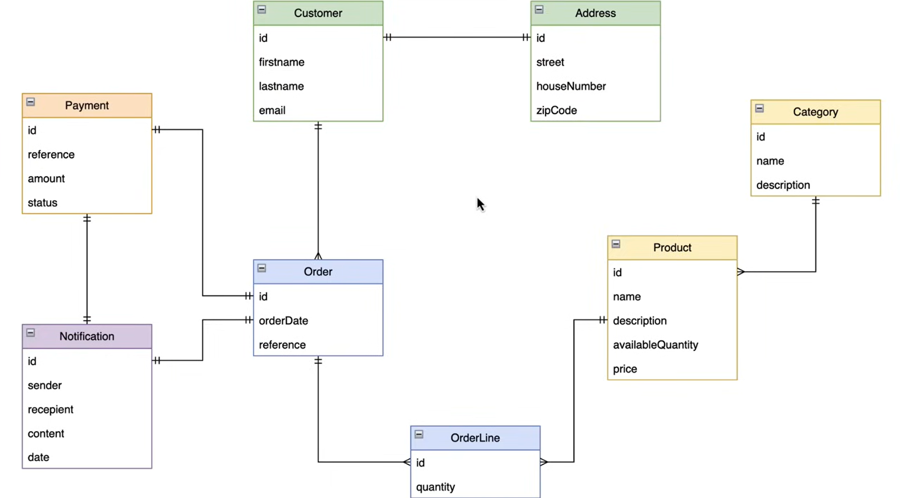

# Spring-boot-microservices
# **Système de Gestion des Commandes Basé sur une Architecture Microservices**

## **Description**
Cette application est une plateforme de commerce électronique moderne développée en utilisant une architecture microservices avec **Spring Boot 3** et **Spring Cloud**. Elle met en œuvre des concepts avancés tels que :
- Le message broker **Kafka**.
- La gestion des configurations centralisée avec **Config Server**.
- Le suivi distribué via **Zipkin**.

---

## **Diagramme de Classe**
Voici un aperçu des entités principales et leurs relations :

### **Entités principales**

1. **Customer** : Représente un client dans le système.
2. **Address** : Représente l'adresse associée à un client.
3. **Product** : Représente un produit disponible dans le système.
4. **Category** : Représente une catégorie à laquelle un produit peut appartenir.
5. **Order** : Représente une commande passée par un client.
6. **OrderLine** : Représente une ligne dans une commande, associée à un produit.
7. **Payment** : Représente le paiement associé à une commande.
8. **Notification** : Responsable de l'envoi des notifications aux clients.

### **Relations Clés**
- **Customer - Address (1:N)** : Un client peut avoir plusieurs adresses.
- **Order - Customer (N:1)** : Une commande est toujours associée à un client.
- **Order - OrderLine (1:N)** : Une commande contient plusieurs lignes.
- **OrderLine - Product (N:1)** : Chaque ligne correspond à un produit unique.
- **Product - Category (N:1)** : Un produit appartient à une catégorie.
- **Order - Payment (1:1)** : Chaque commande est associée à un paiement unique.

---

## **Domain-Driven Design (DDD)**
Cette application applique les principes de **DDD** pour structurer les domaines principaux :

### **Bounded Contexts**
1. **Customer Domain** : Gère les informations relatives aux clients et leurs adresses.
2. **Product Domain** : Responsable des produits et de leurs catégories.
3. **Order Domain** : Gère les commandes et les lignes de commande.
4. **Payment Domain** : Responsable des paiements.
5. **Notification Domain** : Gère l'envoi des notifications.

### **Avantages du DDD**
- **Isoler les responsabilités** : Chaque domaine a son propre contexte.
- **Meilleure maintenabilité** : Les domaines sont indépendants et faciles à étendre.
- **Communication efficace** : Les interactions entre domaines passent par des événements clairs.

---

## **Aperçu de l'Architecture**

Le système est composé de plusieurs microservices interconnectés. Voici les composants clés :

### **Composants Clés**

1. **API Gateway** :
    - Point d'entrée unique pour toutes les requêtes client.
    - Expose les endpoints `/customers`, `/products`, `/orders`, etc.

2. **Microservices principaux** :
    - **Customer Service** : Gère les informations utilisateur et utilise MongoDB.
    - **Product Service** : Gère les informations sur les produits et utilise PostgreSQL.
    - **Order Service** : Responsable des commandes.
    - **Payment Service** : Valide et traite les paiements des commandes (Kafka).
    - **Notification Service** : Envoie des notifications via Kafka.

3. **Services de support** :
    - **Message Broker (Kafka)** : Facilite la communication asynchrone entre microservices.
    - **Config Server** : Centralise la gestion des configurations.
    - **Eureka Server** : Service de découverte pour les microservices.
    - **Zipkin** : Fournit un suivi distribué pour diagnostiquer les appels entre services.

---

## **Fonctionnalités Clés**

1. **Architecture distribuée** : Microservices indépendants pour une meilleure scalabilité.
2. **Communication asynchrone** : Kafka pour les événements comme les confirmations de paiement.
3. **Gestion centralisée des configurations** : Simplifie la gestion des paramètres via Spring Cloud Config.
4. **Suivi distribué** : Zipkin pour monitorer les requêtes à travers les microservices.
5. **Base de données mixte** : MongoDB pour les clients, PostgreSQL pour les commandes et produits.

---

## **Technologies Utilisées**

- **Backend** :
    - Spring Boot 3
    - Spring Cloud (Eureka, Config Server, API Gateway)
    - Spring Data (MongoDB, JPA)

- **Communication** :
    - Apache Kafka pour la messagerie asynchrone

- **Monitoring et Traçage** :
    - Zipkin pour le suivi distribué

- **Conteneurisation** :
    - Docker et Docker Compose pour déployer les microservices

- **Base de données** :
    - MongoDB
    - PostgreSQL

---

## **Implémentation du Projet**

### **1) Infrastructure**

Voici les conteneurs Docker utilisés et leurs rôles :

- **PostgreSQL** : Base de données pour les produits et commandes.
- **PgAdmin** : Interface de gestion pour PostgreSQL.
- **MongoDB** : Base de données pour les clients et notifications.
- **Kafka** : Message broker pour la communication asynchrone.
- **Zookeeper** : Gère la coordination des services Kafka.
- **MailDev** : Simulateur SMTP pour tester l'envoi d'emails.
- **Keycloak** : Gestion des identités et des accès.
- **Zipkin** : Fournit un suivi distribué des requêtes.

### **2) Microservices**

#### **a) Config Server**
- Centralise la gestion des configurations pour tous les microservices.
- **Avantages** :
    - Modification des paramètres sans redéploiement.
    - Unification des configurations.

#### **b) Discovery Service (Eureka)**
- Permet aux microservices de se découvrir dynamiquement.
- **Avantages** :
    - Facilite la scalabilité.
    - Simplifie la communication inter-service.

#### **c) Microservices Principaux**

- **Customer / Product / Order / Payment / Notification** :
    - Implémentent les DTO, services, repositories et contrôleurs.
    - **Avantages des DTO** :
        - Isolent les entités internes.
        - Simplifient les transferts de données.
    - Utilisent des mappers pour convertir entre entités et DTOs.

#### **d) Communication entre Microservices**

1. **Asynchrone (Kafka)** :
    - Implémentation de producteurs et consommateurs pour les événements.

2. **Synchrone** :
    - **OpenFeign** : Intégration déclarative pour les appels API.
    - **RestTemplate** : Pour les appels HTTP basiques.

#### **e) Envoi d'Emails**
- Utilise **JavaMailSender** pour envoyer des emails personnalisés.
- Intégration de templates HTML pour des emails professionnels.

#### **f) API Gateway**
- Point d'entrée unique pour les utilisateurs.
- Implémente la redirection vers les services appropriés.

#### **g) Sécurisation avec Keycloak**
- Gère l'authentification et l'autorisation des utilisateurs.
- Intégré au Gateway pour protéger les endpoints.

#### **h) Traçabilité avec Zipkin**
- Permet de suivre les appels entre microservices.
- Aide au diagnostic des problèmes.

---

## **Conclusion**
Ce projet illustre la puissance des architectures microservices modernes avec une gestion efficace des responsabilités, une communication asynchrone, et une observabilité avancée. Chaque composant est indépendant, rendant le système hautement scalable et maintenable.
